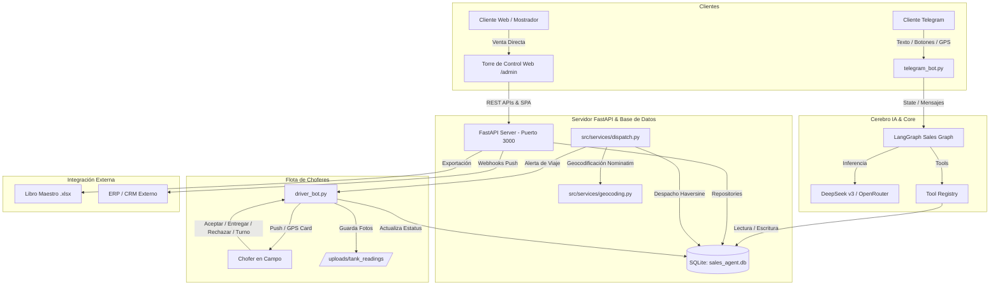
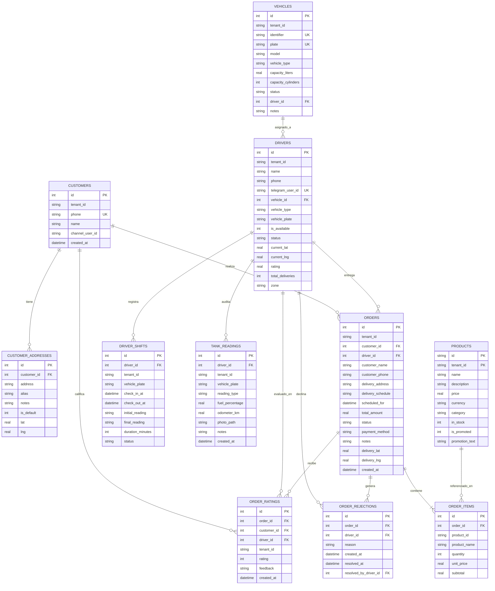

# ⛽ Gas a Tu Puerta - Sistema Integral de Agente de Ventas, Despacho Logístico con IA y Torre de Control Web

> **Documentación Técnica, Arquitectura del Sistema, Torre de Control Administrativa, Ecosistema Dual de Bots y Especificación de APIs REST / Webhooks**  
> **Versión:** 2.4 Enterprise Full-Stack & Responsive Control Tower  
> **Empresa / Tenant Base:** Gas a Tu Puerta - Petroil (Mazatlán, Sinaloa)  
> **Stack Tecnológico:** Python 3.11+, LangGraph, LangChain, FastAPI, Uvicorn, Python-Telegram-Bot, SQLite Relacional, OpenStreetMap (Nominatim), DeepSeek AI (OpenRouter), Single Page Application (HTML5 / Vanilla CSS / Vanilla JS), OpenPyXL (Excel).

---

## 📑 Tabla de Contenidos
1. [Resumen Ejecutivo y Visión General](#1-resumen-ejecutivo-y-visión-general)
2. [Historial y Changelog de Ingeniería (Versión 2.4 Enterprise)](#2-historial-y-changelog-de-ingeniería-versión-24-enterprise)
3. [Torre de Control Web y Backoffice Administrativo (`/admin`)](#3-torre-de-control-web-y-backoffice-administrativo-admin)
   - 3.1 [Dashboard en Vivo y Métricas KPI](#31-dashboard-en-vivo-y-métricas-kpi)
   - 3.2 [Gestión de Pedidos, Envíos y Reasignación](#32-gestión-de-pedidos-envíos-y-reasignación)
   - 3.3 [Agenda Programada y Activación Automática (30 min antes de Deadline)](#33-agenda-programada-y-activación-automática-30-min-antes-de-deadline)
   - 3.4 [Bitácora de Incidencias y Rechazos de Choferes](#34-bitácora-de-incidencias-y-rechazos-de-choferes)
   - 3.5 [Catálogo de Productos en Tiempo Real](#35-catálogo-de-productos-en-tiempo-real)
   - 3.6 [Flota de Choferes, Turnos y Lecturas de Tanque](#36-flota-de-choferes-turnos-y-lecturas-de-tanque)
   - 3.7 [Inventario de Unidades y Vehículos (Pipas vs Camionetas)](#37-inventario-de-unidades-y-vehículos-pipas-vs-camionetas)
   - 3.8 [Directorio de Clientes y Multi-Dirección](#38-directorio-de-clientes-y-multi-dirección)
   - 3.9 [Libro Maestro y Reportes en Excel (.xlsx)](#39-libro-maestro-y-reportes-en-excel-xlsx)
   - 3.10 [Venta Directa / Mostrador / Call Center](#310-venta-directa--mostrador--call-center)
   - 3.11 [Modo Claro / Modo Oscuro y Diseño 100% Responsivo](#311-modo-claro--modo-oscuro-y-diseño-100-responsivo)
4. [Ecosistema Dual de Bots de Telegram](#4-ecosistema-dual-de-bots-de-telegram)
   - 4.1 [Bot de Atención a Clientes (`telegram_bot.py`)](#41-bot-de-atención-a-clientes-telegram_botpy)
   - 4.2 [Bot de Choferes y Despacho en Campo (`driver_bot.py`)](#42-bot-de-choferes-y-despacho-en-campo-driver_botpy)
5. [Arquitectura Global del Sistema](#5-arquitectura-global-del-sistema)
6. [Ciclo de Vida y Flujo Completo del Pedido](#6-ciclo-de-vida-y-flujo-completo-del-pedido)
7. [Catálogo de Herramientas del Agente IA (LangGraph Tools)](#7-catálogo-de-herramientas-del-agente-ia-langgraph-tools)
8. [Especificación de APIs REST (Backoffice y Servidor Externo)](#8-especificación-de-apis-rest-backoffice-y-servidor-externo)
9. [Sistema de Webhooks en Tiempo Real (Event-Driven)](#9-sistema-de-webhooks-en-tiempo-real-event-driven)
10. [Esquema de Base de Datos SQLite Relacional (Schema v2.4)](#10-esquema-de-base-de-datos-sqlite-relacional-schema-v24)
11. [Estructura del Repositorio y Código Fuente](#11-estructura-del-repositorio-y-código-fuente)
12. [Guía de Configuración, Ejecución y Despliegue](#12-guía-de-configuración-ejecución-y-despliegue)

---

## 1. Resumen Ejecutivo y Visión General

**Gas a Tu Puerta - Petroil** es una plataforma integral de comercio conversacional y despacho logístico diseñada para la venta y distribución de Gas LP (cilindros de 10, 20, 30, 45 kg y recarga de tanque estacionario).

El sistema articula cuatro pilares fundamentales:
1. **Inteligencia Artificial Conversacional (LangGraph + DeepSeek):** Un agente multi-tenant capaz de consultar catálogos reales, reconocer clientes frecuentes, gestionar direcciones múltiples, geocodificar domicilios por texto o GPS, y estructurar pedidos con confirmación obligatoria previa.
2. **Bot de Choferes en Campo (Telegram):** Canal directo para los operadores con control de turnos (asistencia), registro fotográfico de medidores/odómetro, recepción de viajes con tarjeta interactiva de navegación (Google Maps / Waze), confirmación de cobro y reporte estructurado de incidencias.
3. **Torre de Control y Backoffice Administrativo Web (`/admin`):** Panel web reactivo y responsivo para supervisión operativa, mesa de agenda con activación automática, gestión de flota vehicular, control de asistencia, catálogo dinámico, exportación a Excel y levantamiento de pedidos por mostrador.
4. **Motor de Despacho y APIs REST:** Despacho inteligente por proximidad geográfica (Haversine), colas de pedidos agendados, persistencia relacional SQLite y contratos de API REST/Webhooks listos para integración externa con ERPs.

---

## 2. Historial y Changelog de Ingeniería (Versión 2.4 Enterprise)

### 🔹 Novedades y Mejoras Implementadas:
* **Torre de Control Web (FastAPI + SPA):** Servidor local unificado en el puerto 3000 con endpoints REST, WebSockets y Backoffice SPA con refresco automático continuo (cada 8 segundos).
* **Mesa de Agenda Programada y Activación Automática:** Pedidos con horario pactado / deadline entran automáticamente a la mesa de despacho activa **30 minutos antes** de su hora pactada; incluye temporizadores de cuenta regresiva, filtros de fecha (Hoy / Mañana / Todos) y botón de pase inmediato.
* **Control de Asistencia y Turnos de Choferes:** Registro de horas de entrada (`check_in_at`), salida (`check_out_at`), duración neta trabajada, odómetro inicial/final y lecturas de tanque con respaldo fotográfico.
* **Gestión de Flota Vehicular (`vehicles`):** Separación y administración estricta de Pipas de Gas Estacionario (con capacidad en Litros) vs Camionetas de Cilindros (con capacidad en unidades de tanques), placas, modelos y operadores asignados.
* **Bitácora de Incidencias y Motivos de Rechazo:** Captura del motivo exacto cuando un chofer declina un pedido (ej. *Falla mecánica en bomba*, *Desabasto*, *Tráfico pesado*), con alerta en el tablero y reasignación en un clic.
* **Módulo de Venta Directa / Mostrador / Call Center:** Formulario de captura rápida desde la Torre de Control con cálculo automático de totales, selección de despacho (automático inteligente, chofer directo o pendiente) y horario pactado.
* **Centro de Reportes y Libro Maestro Excel:** Descarga de libro de trabajo `.xlsx` con 4 hojas formateadas profesionalmente (Pedidos & Ventas, Incidencias & Rechazos, Flota de Choferes, Directorio de Clientes).
* **Encuestas de Satisfacción CSAT:** Calificación del servicio (1 a 5 estrellas) con desglose en el tablero para evaluar el rendimiento de cada chofer.
* **Diseño Responsivo y Tema Adaptativo Claro/Oscuro:**
  * Modo Claro y Modo Oscuro conmutables con botón interactivo (`☀️ Modo Claro` / `🌙 Modo Oscuro`) y persistencia en `localStorage`.
  * Optimizado para Monitores Grandes (1920px+ / Ultrawide), Pantallas de Laptop (1366x768 / 1280x800) sin pérdida de información, Tablets (con Drawer y botón hamburguesa `☰`) y Smartphones.

---

## 3. Torre de Control Web y Backoffice Administrativo (`/admin`)

La Torre de Control está disponible en `http://localhost:3000/admin`. Ofrece una interfaz centralizada y en tiempo real para coordinar todas las operaciones de la empresa.

```
                  ┌──────────────────────────────────────────────────────────┐
                  │          TORRE DE CONTROL PETROIL (/admin)                │
                  ├─────────────────┬────────────────────────────────────────┤
                  │  BARRA LATERAL  │         PANEL DE TRABAJO PRINCIPAL     │
                  │  • Dashboard    │  1. Métricas KPI en Vivo (8 tarjetas)  │
                  │  • Pedidos      │  2. Tablero de Pedidos Activos         │
                  │  • Agenda       │  3. Mesa de Agenda Programada (30 min) │
                  │  • Incidencias  │  4. Control de Asistencia y Turnos     │
                  │  • Catálogo     │  5. Reasignación Rápida de Choferes    │
                  │  • Choferes     │  6. Filtros & Búsqueda Instantánea     │
                  │  • Vehículos    │  7. Venta Directa (➕ Levantar Pedido)  │
                  │  • Clientes     │  8. Exportación de Libro Maestro Excel │
                  │  • Reportes     │  9. Selector de Modo Claro / Oscuro    │
                  └─────────────────┴────────────────────────────────────────┘
```

### 3.1 Dashboard en Vivo y Métricas KPI
El tablero principal resume las métricas operativas clave del día:
* **🔥 Pedidos Activos:** Conteo en tiempo real de pedidos en cola, asignados o en ruta.
* **🚨 Incidencias / Rechazos:** Conteo de viajes rechazados pendientes de reasignar.
* **🛻 Flota de Choferes:** Distribución de operadores (🟢 Disponibles / 🟡 En Entrega / 🔴 Fuera de Servicio).
* **📦 Entregas Completadas:** Total de órdenes cerradas con éxito.
* **💰 Ventas Totales Cobradas:** Monto acumulado de ventas recaudadas en el día.
* **💵 Cobrado en Efectivo:** Desglose del total recibido en dinero en efectivo.
* **💳 Cobrado con Tarjeta:** Desglose del total cobrado con terminal bancaria.
* **⭐ Satisfacción Choferes (CSAT):** Promedio de calificación (1.0 a 5.0 ⭐) y conteo de encuestas.

### 3.2 Gestión de Pedidos, Envíos y Reasignación
* **Filtros por Estado:** Todos, Activos, Pendientes de Asignar (`confirmed`), Rechazados (`rejected_by_driver`), Asignados (`assigned`), En Ruta (`in_route`), Entregados (`delivered`), Programados (`scheduled`), Cancelados (`cancelled`).
* **Búsqueda Instantánea:** Búsqueda en tiempo real por número de folio (#ID), nombre de cliente, teléfono, colonia o calle.
* **Reasignación Rápida:** Botón `🛻 Reasignar` que despliega un modal con los choferes disponibles y transfiere la orden emitiendo una alerta push al nuevo chofer.
* **Cambio de Estado Manual y Disculpa al Cliente:** Al cancelar un pedido desde el Backoffice, se puede capturar un motivo que se envía automáticamente por Telegram al cliente.

### 3.3 Agenda Programada y Activación Automática (30 min antes de Deadline)
* **Regla de los 30 Minutos:** Los pedidos agendados para horarios o fechas posteriores permanecen en estado `scheduled` y se activan automáticamente en la mesa de despacho activa **exactamente 30 minutos antes de su deadline**.
* **Temporizador de Cuenta Regresiva:** Cada pedido muestra el tiempo restante (`🕒 Faltan 2h 15m` o `⚡ Se activa en 10 min`).
* **Pase Directo Manual (`⚡ Pasar a Pedidos Ya`):** Permite al despachador transferir el pedido a la mesa activa sin esperar el tiempo automático.
* **Reprogramación de Horario (`✏️ Reprogramar`):** Permite ajustar la fecha y hora pactada con el cliente.

### 3.4 Bitácora de Incidencias y Rechazos de Choferes
* Monitoreo de viajes rechazados con el motivo capturado por el chofer (*Falla mecánica*, *Desabasto*, *Tráfico*, etc.).
* Permite reasignar el pedido inmediatamente a otra unidad disponible o exportar la bitácora en Excel.

### 3.5 Catálogo de Productos en Tiempo Real
* Alta, edición, cambio de precios y control de existencia (`in_stock`) para cilindros y suministro estacionario.
* Los cambios realizados en la Torre de Control se reflejan de inmediato en los botones y respuestas de los bots.

### 3.6 Flota de Choferes, Turnos y Lecturas de Tanque
* **Directorio de Operadores:** Nombre, teléfono, unidad asignada, zona de operación, ID de Telegram y estado operativo.
* **Historial de Asistencia y Turnos:** Horas de entrada/salida, minutos laborados y lecturas iniciales/finales.
* **Auditoría de Cargas de Tanque:** Lecturas de porcentaje de gas LP, odómetro en kilómetros y visualización de la fotografía del medidor.

### 3.7 Inventario de Unidades y Vehículos (Pipas vs Camionetas)
* **Pipas de Gas Estacionario:** Registro con capacidad máxima en litros (ej. 5,000 L), placas, modelo y chofer asignado.
* **Camionetas de Cilindros:** Registro con capacidad máxima en número de tanques (ej. 40 cilindros), placas y operador.
* **Estatus Operativo:** Activa, En Mantenimiento, Inactiva.

### 3.8 Directorio de Clientes y Multi-Dirección
* Historial de compras por cliente, teléfono de contacto, total gastado acumulado y catálogo de domicilios registrados con sus referencias.

### 3.9 Libro Maestro y Reportes en Excel (.xlsx)
Generación dinámica de archivos Excel con formato empresarial:
* **Libro Maestro Completo:** Archivo multipestaña con 4 hojas: *Pedidos & Ventas*, *Incidencias & Rechazos*, *Flota de Choferes* y *Directorio de Clientes*.
* **Reportes Individuales:** Descargas filtradas de pedidos, incidencias, choferes o clientes.

### 3.10 Venta Directa / Mostrador / Call Center
Modal `➕ Levantar Pedido` que permite a los operadores de oficina:
1. Capturar nombre, teléfono y dirección del cliente.
2. Seleccionar productos y cantidades con cálculo automático de totales.
3. Elegir entrega inmediata o programada (con deadline).
4. Seleccionar método de pago (Efectivo / Tarjeta / Transferencia).
5. Asignar despacho automático inteligente, chofer directo o dejarlo en cola pendiente.

### 3.11 Modo Claro / Modo Oscuro y Diseño 100% Responsivo
* **Conmutador de Tema:** Botón `☀️ Modo Claro` / `🌙 Modo Oscuro` en la barra superior y pie lateral con guardado en `localStorage`.
* **Modo Oscuro:** Fondo Obsidian Navy (`#0b1120`), tarjetas de cristal translúcidas y acentos cian/esmeralda.
* **Modo Claro:** Fondo Slate limpio (`#f1f5f9`), tarjetas blancas puras con sombras suaves y contraste optimizado.
* **Responsividad Completa:**
  * **Monitores Grandes (1920px+ / Ultrawide):** Diseño fluido que aprovecha todo el ancho disponible.
  * **Laptops (1366x768 / 1280x800):** Cero pérdida de información con tablas legibles y modales con scroll interno.
  * **Tablets (768px - 1024px):** Barra lateral convertida en cajón desplegable (Drawer) con botón hamburguesa `☰`.
  * **Smartphones (320px - 767px):** Cuadrícula de KPIs en 2 columnas, botones táctiles y modales adaptados.

---

## 4. Ecosistema Dual de Bots de Telegram

El sistema opera con dos bots independientes pero interconectados en tiempo real mediante la base de datos y eventos de despacho.

```
┌──────────────────────────────────────┐     ┌──────────────────────────────────────┐
│     BOT DE CLIENTES (Ventas)         │     │     BOT DE CHOFERES (Logística)      │
│         telegram_bot.py              │     │           driver_bot.py              │
├──────────────────────────────────────┤     ├──────────────────────────────────────┤
│ • Selección de Tipo de Servicio      │     │ • Control de Asistencia y Turnos     │
│ • Catálogo Real y Cantidades         │     │ • Registro de Odómetro y Foto Gas    │
│ • Búsqueda por 10 Dígitos            │     │ • Tarjeta GPS con Google Maps & Waze │
│ • Direcciones Guardadas & GPS        │     │ • Botón "Aceptar Viaje" (in_route)   │
│ • Horarios de Entrega & Pagos        │     │ • Botón "Marcar Entregado & Cobrado" │
│ • Resumen Financiero Obligatorio     │     │ • Motivos de Rechazo Estructurados   │
│ • Botón Inline Cancelar Pedido       │     │ • Ubicación GPS en Tiempo Real       │
└──────────────────────────────────────┘     └──────────────────────────────────────┘
```

### 4.1 Bot de Atención a Clientes (`telegram_bot.py`)
Implementa un detector contextual (`detect_reply_markup`) que asiste al cliente mediante una experiencia híbrida:
1. **Tipo de Servicio:** `[ 🛢️ Cilindros ]` y `[ 🔥 Tanque Estacionario ]`.
2. **Presentaciones Reales:** Botones generados dinámicamente desde SQLite (ej. `[ 🟢 Cilindro de 30 kg — $670 MXN ]`).
3. **Cantidades Rápidas:** `[ 1 ]`, `[ 2 ]`, `[ 3 ]`, `[ 4 ]`, `[ ✍️ Otra cantidad ]`.
4. **Reconocimiento de Cliente:** Identifica si el número celular tiene direcciones guardadas y las presenta en botones (`[ 🏠 Casa Principal... ]`, `[ ➕ Nueva Dirección ]`).
5. **Geolocalización:** Soporta texto libre o botón de envío de pin GPS nativo de Telegram.
6. **Horarios:** `[ ⚡ Lo antes posible ]`, `[ 🕐 Hoy por la tarde ]`, `[ 📅 Mañana ]`.
7. **Métodos de Pago:** `[ 💵 Efectivo ]`, `[ 💳 Tarjeta (Terminal) ]`.
8. **Confirmación Obligatoria:** Muestra el desglose financiero completo y requiere presionar `[ ✅ Confirmar pedido ]` para crear la orden.
9. **Botón Cancelar:** Cada pedido generado incluye un botón inline `[ ❌ Cancelar Pedido #ID ]`.

### 4.2 Bot de Choferes y Despacho en Campo (`driver_bot.py`)
1. **Control de Turnos:** Botones `[ 🟢 Iniciar Turno ]`, `[ ⏸️ Pausar ]` y `[ 🛑 Terminar Turno ]`.
2. **Lectura y Foto de Medidor:** Al iniciar y cerrar turno, solicita el odómetro en km y porcentaje del tanque con foto de evidencia obligatoria.
3. **Tarjeta de Pedido Entrante:** Envía la información completa del cliente, productos y monto con botones de navegación:
   * `[ 🗺️ Abrir en Google Maps (Navegación) ]`
   * `[ 🧭 Abrir en Waze ]`
   * `[ 🟢 Aceptar Viaje ]`
   * `[ ❌ Rechazar Pedido ]` (despliega menú interactivo de motivos)
4. **Cierre de Entrega:** Botón `[ ✅ Marcar como Entregado y Cobrado ]` que actualiza el estado a `delivered`, libera al chofer y envía la encuesta de satisfacción al cliente.

---

## 5. Arquitectura Global del Sistema



---

## 6. Ciclo de Vida y Flujo Completo del Pedido

```
  [ Cliente Solicita ]
           │
           ▼
  [ Selección de Producto & Cantidad ]
           │
           ▼
  [ Validación de Domicilio & GPS ]
           │
           ▼
  [ Horario & Método de Pago ]
           │
           ▼
  [ Resumen Financiero & Confirmación ]
           │
           ├───────────────────────────────┐
           ▼ (Inmediato)                   ▼ (Programado >30 min)
  [ Estado: confirmed ]           [ Estado: scheduled (Agenda) ]
           │                               │
           │                               ▼ (Al llegar a T-30 min)
           │                      [ Se activa automáticamente ]
           ▼                               │
  [ Despacho Inteligente (Haversine) ] ◄───┘
           │
           ▼
  [ Notificación a Chofer (driver_bot) ]
           │
     ┌─────┴─────────────────────────┐
     ▼ (Acepta)                      ▼ (Rechaza con motivo)
[ in_route ]                 [ Registra en Bitácora Incidencias ]
     │                               │
     │                               ▼
     │                       [ Reasignación Inmediata a otro Chofer ]
     ▼
[ delivered ] ──► [ Encuesta CSAT al Cliente (⭐ 1-5) ]
```

---

## 7. Catálogo de Herramientas del Agente IA (LangGraph Tools)

| Herramienta | Archivo | Descripción y Parámetros |
| :--- | :--- | :--- |
| `get_customer_info` | `customer_info.py` | Busca por 10 dígitos numéricos limpios. Devuelve historial, compras previas y lista de direcciones registradas con alias y notas. |
| `search_products` | `search_products.py` | Consulta en tiempo real el catálogo de SQLite filtrado por categoría (`cilindros`, `estacionario`) y stock activo. |
| `create_order` | `create_order.py` | Registra el pedido en SQLite, genera el folio #ID, calcula subtotales, geocodifica coordenadas y detona el motor de despacho. |
| `cancel_order` | `cancel_order.py` | Cancela un pedido activo a solicitud del cliente o de la Torre de Control, liberando a la unidad asignada. |
| `get_order_status` | `get_order_status.py` | Consulta el estado en vivo de una orden por ID o teléfono del cliente. |
| `get_promotions` | `get_promotions.py` | Consulta promociones, descuentos vigentes o beneficios por volumen. |

---

## 8. Especificación de APIs REST (Backoffice y Servidor Externo)

### Cabeceras HTTP Estándar
```http
Content-Type: application/json
Accept: application/json
X-Tenant-ID: petroil
```

### 8.1 Métricas y Dashboard
* **`GET /api/admin/metrics`**: Retorna pedidos activos, incidencias pendientes, choferes por estado, ventas en efectivo/tarjeta y promedio CSAT.
* **`GET /api/admin/shifts`**: Retorna el historial de asistencia y turnos de los choferes del día.

### 8.2 Pedidos y Agenda
* **`GET /api/admin/orders?status={status}&limit={limit}`**: Lista pedidos con soporte de filtros por estatus.
* **`GET /api/admin/orders/{order_id}`**: Detalle completo de un pedido con desglose de productos y chofer.
* **`POST /api/admin/orders`**: Crea un pedido manual (Venta directa / Call center).
* **`POST /api/admin/orders/{order_id}/reassign`**: Reasigna un pedido a un nuevo chofer:
  ```json
  { "driver_id": 5 }
  ```
* **`PATCH /api/admin/orders/{order_id}/status`**: Actualiza el estado del pedido con motivo opcional:
  ```json
  { "status": "cancelled", "reason": "Domicilio inaccesible por obras" }
  ```
* **`GET /api/admin/agenda`**: Lista de pedidos programados con cálculo de minutos para activación y deadline.
* **`POST /api/admin/orders/{order_id}/activate-now`**: Transfiere de inmediato un pedido programado a la mesa activa.
* **`PATCH /api/admin/orders/{order_id}/reschedule`**: Modifica la fecha/hora pactada de un pedido:
  ```json
  { "scheduled_for": "2026-09-08T16:00:00", "schedule_text": "Mañana a las 4:00 PM" }
  ```

### 8.3 Incidencias y Rechazos
* **`GET /api/admin/rejections`**: Lista la bitácora de viajes rechazados por choferes con su motivo reportado.

### 8.4 Flota de Choferes y Unidades
* **`GET /api/admin/drivers`**: Lista completa de choferes con estatus operativo y ubicación GPS.
* **`POST /api/admin/drivers`**: Registra un nuevo operador.
* **`PUT /api/admin/drivers/{driver_id}`**: Actualiza datos del chofer o vehículo asignado.
* **`GET /api/admin/drivers/{driver_id}/ratings`**: Consulta encuestas y calificaciones CSAT del chofer.
* **`GET /api/admin/vehicles`**: Lista inventario de pipas y camionetas.
* **`POST /api/admin/vehicles`**: Registra una nueva unidad vehicular.
* **`PUT /api/admin/vehicles/{vehicle_id}`**: Actualiza placas, capacidad o estado de mantenimiento.

### 8.5 Catálogo de Productos
* **`GET /api/admin/products`**: Consulta catálogo para administración.
* **`POST /api/admin/products`**: Agrega nuevo producto al catálogo.
* **`PUT /api/admin/products/{product_id}`**: Actualiza precio, descripción o existencia.
* **`DELETE /api/admin/products/{product_id}`**: Elimina o desactiva un producto.

### 8.6 Reportes Excel (.xlsx)
* **`GET /api/admin/reports/excel/master`**: Descarga el Libro Maestro con 4 hojas organizadas.
* **`GET /api/admin/reports/excel/orders`**: Descarga reporte de pedidos.
* **`GET /api/admin/reports/excel/rejections`**: Descarga bitácora de incidencias.
* **`GET /api/admin/reports/excel/drivers`**: Descarga reporte de choferes y rendimiento.
* **`GET /api/admin/reports/excel/customers`**: Descarga directorio de clientes.

---

## 9. Sistema de Webhooks en Tiempo Real (Event-Driven)

| Evento | Disparador | Payload Principal |
| :--- | :--- | :--- |
| `order.created` | Cliente confirma pedido en bot o Torre de Control. | `order_id`, `folio`, `customer`, `items`, `total`, `gps` |
| `order.assigned` | Chofer asignado por algoritmo Haversine o despachador. | `order_id`, `driver_id`, `driver_name`, `vehicle_plate` |
| `order.in_route` | Chofer presiona **"Aceptar Viaje"** en Telegram. | `order_id`, `driver_id`, `in_route_at` |
| `order.delivered` | Chofer presiona **"Marcar como Entregado"**. | `order_id`, `total_amount`, `payment_method`, `delivered_at` |
| `order.rejected` | Chofer presiona **"Rechazar Pedido"** con motivo. | `order_id`, `driver_id`, `rejection_reason` |
| `order.cancelled` | Pedido cancelado por cliente o despachador. | `order_id`, `cancelled_by`, `reason` |
| `driver.shift_started` | Chofer presiona **"Iniciar Turno"** y envía foto. | `driver_id`, `vehicle_plate`, `initial_reading` |
| `driver.shift_ended` | Chofer presiona **"Terminar Turno"** y lectura final. | `driver_id`, `duration_minutes`, `final_reading` |

---

## 10. Esquema de Base de Datos SQLite Relacional (Schema v2.4)



---

## 11. Estructura del Repositorio y Código Fuente

```text
langgraph-sales-agent/
│
├── DOCUMENTACION_COMPLETA_PROYECTO.md # 📘 Este documento maestro del sistema
├── telegram_bot.py                   # 🤖 Bot de Atención y Ventas a Clientes (Telegram)
├── driver_bot.py                     # 🛻 Bot de Operadores, Asistencia y Choferes (Telegram)
├── view_db.py                        # 👁️ Monitor interactivo de base de datos en terminal
├── reset_db.py                       # 🔄 Script para limpiar o reiniciar BD / borrar cliente
├── pyproject.toml                    # 📦 Definición de dependencias Python del proyecto
│
├── src/
│   ├── app.py                        # 🚀 Servidor Web Principal FastAPI (Puerto 3000)
│   │
│   ├── admin/                        # 🏛️ Torre de Control & Backoffice Web
│   │   ├── router.py                 # Endpoints REST API de administración y Excel
│   │   └── static/                   # SPA Frontend (HTML5 / Vanilla CSS / JS)
│   │       ├── index.html            # Interfaz SPA de la Torre de Control
│   │       ├── css/
│   │       │   └── admin.css         # Sistema de diseño responsivo + Temas Claro/Oscuro
│   │       └── js/
│   │           └── admin.js          # Lógica SPA, gráficos KPI, modales y auto-refresh
│   │
│   ├── channels/                     # Adaptadores de Canales de Comunicación
│   │   ├── telegram/                 # Routers y webhooks de Telegram
│   │   ├── web/                      # Sales Studio y cliente Web Chat
│   │   ├── whatsapp/                 # Adaptador WhatsApp Cloud API
│   │   └── instagram/                # Adaptador Instagram DM
│   │
│   ├── config/                       # Configuraciones y cargadores
│   │   ├── settings.py               # Variables de entorno Pydantic
│   │   ├── tenant_config.py          # Cargador dinámico de tenants YAML
│   │   └── llm_provider.py           # Factory de modelos LLM (OpenRouter / Anthropic)
│   │
│   ├── database/                     # Capa de Base de Datos SQLite
│   │   ├── connection.py             # Pool de conexiones y context manager
│   │   └── schema.py                 # Esquema DDL y sembrado de catálogos
│   │
│   ├── graphs/                       # Grafos de Estado LangGraph
│   │   └── sales_graph.py            # Grafo conversacional del agente de ventas
│   │
│   ├── models/                       # Modelos de Datos Pydantic
│   │   ├── order.py                  # Modelos de Pedidos, Items y Estados
│   │   ├── customer.py               # Modelos de Clientes y Direcciones
│   │   ├── driver.py                 # Modelos de Choferes, Turnos y Lecturas
│   │   └── product.py                # Modelos de Catálogo de Productos
│   │
│   ├── nodes/                        # Nodos de Ejecución LangGraph
│   │   ├── assistant.py              # Prompt dinámico y llamado al LLM
│   │   └── tool_executor.py          # Ejecución segura de herramientas
│   │
│   ├── repositories/                 # Repositorios de Acceso a Datos (SQLite)
│   │   ├── base.py                   # Protocolo abstracto de repositorio
│   │   └── sqlite_repo.py            # Implementación completa de consultas SQL
│   │
│   ├── services/                     # Servicios de Negocio y Lógica Auxiliar
│   │   ├── dispatch.py               # Motor de despacho logístico (Haversine)
│   │   ├── geocodificiation.py       # Geocodificador OpenStreetMap (Nominatim)
│   │   ├── ui_keyboards.py           # Generador de teclados interactivos Telegram
│   │   ├── reports.py                # Generador de Libros Excel (.xlsx con OpenPyXL)
│   │   └── vision.py                 # Procesamiento de fotos de medidores/odómetro
│   │
│   └── tools/                        # Herramientas del Agente de Ventas (Tools)
│       ├── customer_info.py          # Búsqueda y reconocimiento de clientes
│       ├── search_products.py        # Consulta de catálogo
│       ├── create_order.py           # Creación y confirmación de pedidos
│       ├── cancel_order.py           # Cancelación de pedidos
│       ├── get_order_status.py       # Consulta de estatus
│       └── get_promotions.py         # Consulta de promociones
│
├── tenants/                          # Configuraciones por Empresa (Multi-Tenant)
│   └── petroil/
│       ├── config.yaml               # Personalidad del agente, reglas y prompts
│       └── products.json             # Catálogo semilla inicial de Gas LP
│
├── data/
│   └── sales_agent.db                # Archivo físico de base de datos SQLite
│
└── uploads/                          # Almacenamiento local de fotografías
    └── tank_readings/                # Fotos de medidores de gas y odómetros
```

---

## 12. Guía de Configuración, Ejecución y Despliegue

### 12.1 Requisitos Previos
* Python 3.11 o superior.
* Entorno virtual activo (`.venv`).
* Conexión a Internet (para APIs de Telegram, OpenRouter y OpenStreetMap).

### 12.2 Archivo de Entorno (`.env`)
Crear un archivo `.env` en la raíz del proyecto con la siguiente configuración:

```ini
# Configuración del LLM
OPENROUTER_API_KEY=sk-or-v1-tu-api-key-de-openrouter

# Tokens de Telegram Bots
TELEGRAM_BOT_TOKEN=123456789:ABCDefGhIjKlMnOpQrStUvWxYz-Clientes
TELEGRAM_DRIVER_BOT_TOKEN=987654321:ZYxWvUtSrQpOnMlKjIhGfEdCbA-Choferes

# Parámetros Regionales y Base de Datos
DEFAULT_CITY="Mazatlán, Sinaloa, México"
DATABASE_PATH="data/sales_agent.db"

# Integración Externa y Webhooks (Opcional)
EXTERNAL_API_BASE_URL="https://api.tuempresa.com/v1"
EXTERNAL_API_KEY="bearer_token_secreto"
WEBHOOK_TARGET_URL="https://api.tuempresa.com/v1/webhooks/gas"
```

### 12.3 Comandos de Ejecución

```powershell
# 1. Iniciar la Torre de Control Web (FastAPI / Uvicorn en http://localhost:3000/admin)
.venv\Scripts\python.exe -m uvicorn src.app:app --host 0.0.0.0 --port 3000

# 2. Iniciar el Bot de Ventas a Clientes (Telegram)
.venv\Scripts\python.exe telegram_bot.py

# 3. Iniciar el Bot de Choferes y Repartidores (Telegram)
.venv\Scripts\python.exe driver_bot.py

# 4. Monitorear la Base de Datos en Tiempo Real (Terminal)
.venv\Scripts\python.exe view_db.py

# 5. Reiniciar Base de Datos desde cero con catálogos limpios (Opcional)
.venv\Scripts\python.exe reset_db.py --all

# 6. Borrar un cliente específico por teléfono (Opcional)
.venv\Scripts\python.exe reset_db.py --phone 6699123501
```

---

### 🌐 URLs de Acceso Local:
* **Torre de Control / Backoffice Administrativo:** [http://localhost:3000/admin](http://localhost:3000/admin)
* **Sales Studio / Web Chat Client:** [http://localhost:3000](http://localhost:3000)
* **Documentación Interactiva Swagger / OpenAPI:** [http://localhost:3000/docs](http://localhost:3000/docs)
* **Documentación ReDoc:** [http://localhost:3000/redoc](http://localhost:3000/redoc)
