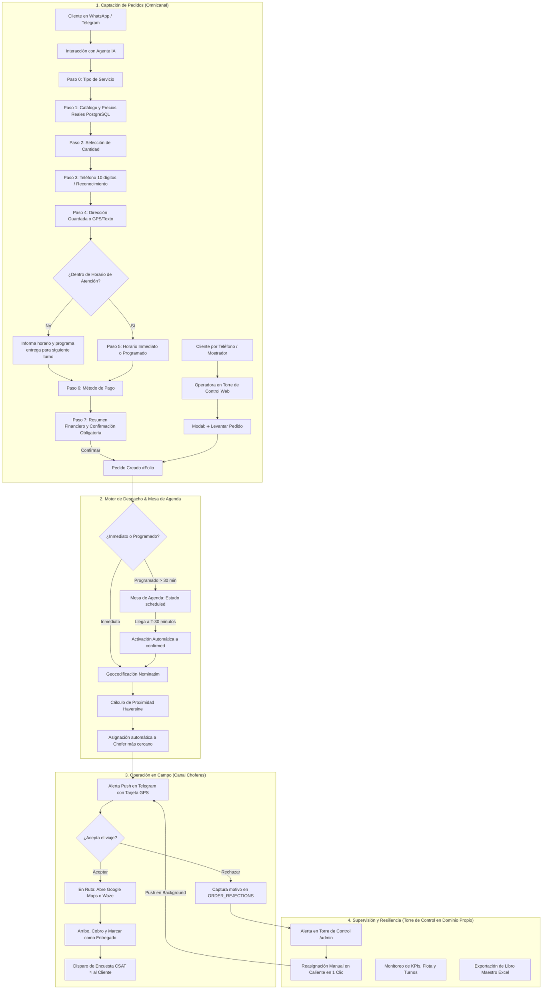
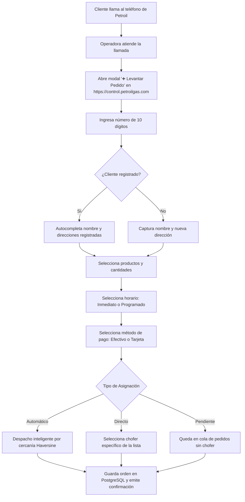
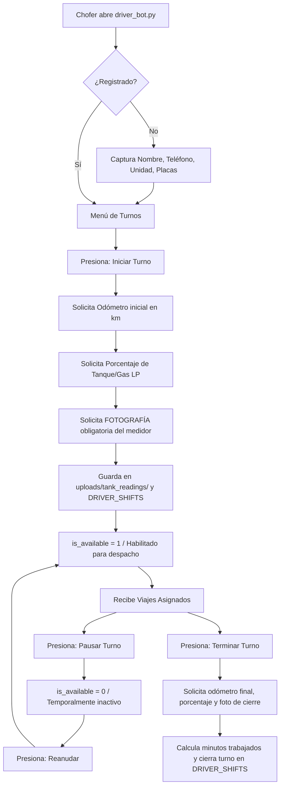
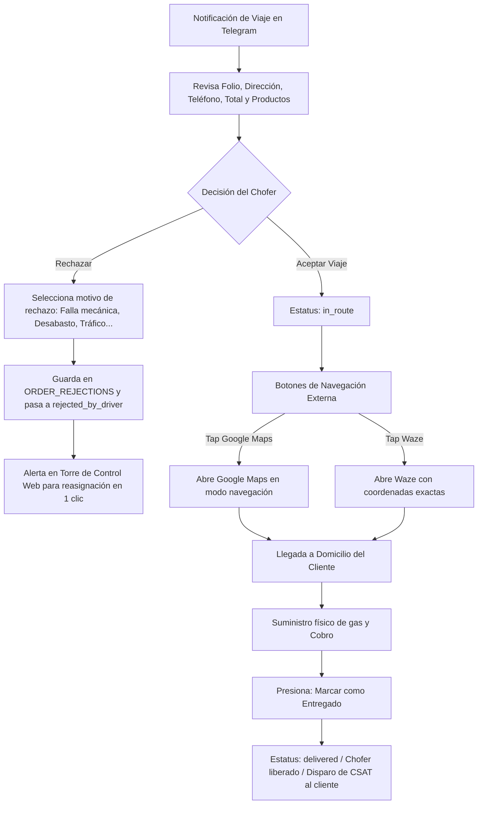
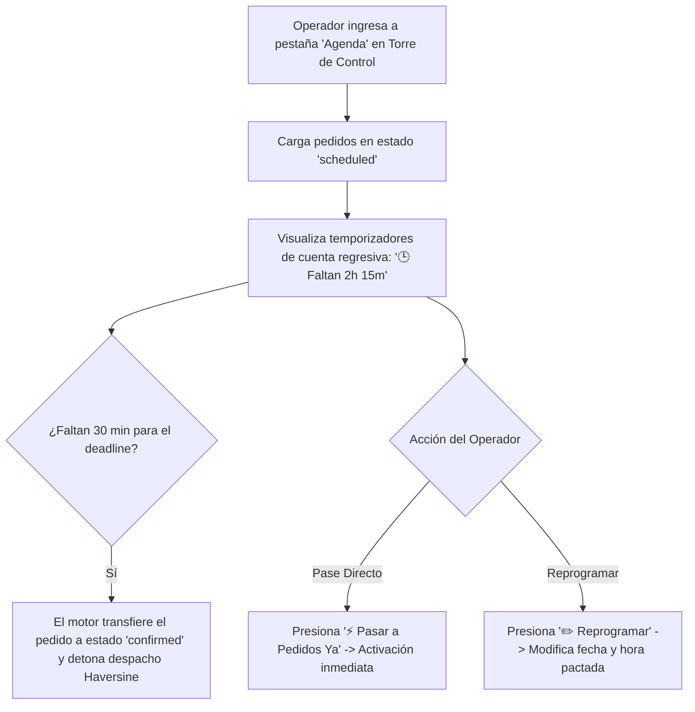

# User Flows & Navigation — Ecosistema Digital Gasera (Gas a tu Puerta)

**Cliente:** Grupo Petroil — División Gas (Mazatlán, Sinaloa)  
**Versión:** 3.5.0 Enterprise — Consolidada con la Arquitectura Real Implementada (LangGraph AI Sales Agent, Omnicanalidad WhatsApp/Telegram/Call Center, PostgreSQL Corporativo Petroil, Torre de Control Web en Dominio Propio & Despacho Haversine)  
**Estado:** Documento Maestro de Flujos de Usuario Aprobado y Vigente  
**Fuentes Oficiales de Verdad:** `product-context.md` v3.5, `prd.md` v3.5, `architecture.md` v3.5 y Código Fuente del Repositorio  
**Fecha:** Septiembre 2026  

---

## 1. Propósito

El presente documento define la arquitectura de navegación, flujos de interacción y secuencias operativas del ecosistema **Gas a Tu Puerta - Petroil**, estructurado bajo el patrón canónico:
$$\text{ACTOR} \longrightarrow \text{ENTRADA} \longrightarrow \text{CANAL / PANTALLA} \longrightarrow \text{ACCIÓN} \longrightarrow \text{DECISIÓN} \longrightarrow \text{RESULTADO OPERATIVO}$$

Este artefacto refleja la operación real del sistema:
* **Canal Clientes Omnicanal:** Agente conversacional con IA (LangGraph + DeepSeek v3) en **WhatsApp** y **Telegram** con teclados interactivos, validación de horarios de atención y encuestas CSAT.
* **Canal Telefónico y Mostrador:** Módulo de Venta Directa en la Torre de Control Web (`➕ Levantar Pedido`) para captura ágil de llamadas de call center.
* **Canal Choferes:** Bot operativo en Telegram (`driver_bot.py`) con control de asistencia (odómetro y foto obligatoria), tarjetas de viaje GPS y enlaces directos a **Google Maps** y **Waze**.
* **Torre de Control Web (Dominio Propio Institucional):** Consola administrativa SPA servida en `https://control.petroilgas.com` con monitoreo en vivo, mesa de agenda con activación automática a **T-30 minutos**, reasignación en caliente con push, bitácora de rechazos, control de pipas vs camionetas y descarga de reportes Excel (`openpyxl`).

---

## 2. Mapa General de Flujos del Ecosistema



---

# PARTE 1: FLUJOS DEL CANAL CLIENTES (WHATSAPP & TELEGRAM BOT CON IA)

---

## 3. Flujo C-01: Ciclo de Compra Guiado con Menús Interactivos

### 3.1. Resumen del Flujo
El cliente solicita gas por WhatsApp o Telegram. El asistente IA analiza el mensaje y despliega teclados interactivos sin exigir escritura manual en pasos estructurados.

### 3.2. Paso a Paso Detallado

```
Paso 0: Bienvenida & Tipo de Servicio
 ├─ Bot: "¡Hola! Bienvenido a Gas a Tu Puerta - Petroil ⛽ ¿Qué servicio necesitas hoy?"
 └─ Botones: [ 🛢️ Cilindros ]  [ 🔥 Tanque Estacionario ]

Paso 1: Catálogo y Precios Reales
 ├─ (Si seleccionó Cilindros): Consulta PostgreSQL para tenant 'petroil'.
 └─ Botones:
     [ 🟢 Cilindro de 30 kg — $670 MXN ]
     [ 🔵 Cilindro de 20 kg — $450 MXN ]
     [ 🟡 Cilindro de 45 kg — $1,010 MXN ]
     [ ⚪ Cilindro de 10 kg — $230 MXN ]

Paso 2: Selección Ágil de Cantidad
 ├─ (Si cilindros): Botones: [ 1 ]  [ 2 ]  [ 3 ]  [ 4 ]  [ ✍️ Otra cantidad ]
 └─ (Si estacionario): Botones: [ $300 ]  [ $500 ]  [ $1,000 ]  [ Tanque Lleno ]  [ ✍️ Otro monto ]

Paso 3: Identificación Telefónica y Reconocimiento
 ├─ Bot: "Por favor indícame tu número celular a 10 dígitos."
 └─ Cliente escribe: "6699123501" -> Sistema depura y ejecuta 'customer_info'.

Paso 4: Libreta de Direcciones o Nueva Dirección
 ├─ Si cliente frecuente:
 │   Bot: "¡Qué gusto saludarte de nuevo, Oscar! ¿A cuál de tus domicilios enviamos tu gas?"
 │   Botones:
 │     [ 🏠 Casa Principal: Mision San Javier 5246... ]
 │     [ 🏢 Local Centro: Ángel Flores 101... ]
 │     [ ➕ Ingresar Nueva Dirección ]
 └─ Si cliente nuevo o selecciona 'Nueva Dirección':
     Botones: [ ✍️ Escribir dirección ]  [ 📍 Enviar ubicación GPS ]

Paso 5: Validación de Horario de Atención y Programación
 ├─ Si dentro de horario:
 │   Botones: [ ⚡ Lo antes posible ]  [ 🕐 Hoy por la tarde ]  [ 📅 Mañana ]
 └─ Si fuera de horario (configuración TBD):
     Bot: "Nuestro horario de atención ha concluido por hoy. ¿Deseas agendar tu pedido para mañana a primera hora?"
     Botones: [ 📅 Agendar para Mañana a las 8:00 AM ]  [ ✏️ Elegir otra hora ]

Paso 6: Método de Pago
 ├─ Bot: "¿Cómo deseas realizar tu pago?"
 └─ Botones: [ 💵 Efectivo ]  [ 💳 Tarjeta (Terminal) ]

Paso 7: Resumen Financiero y Confirmación Obligatoria Previa
 ├─ Bot:
 │   "📋 Resumen de tu pedido:
 │    • 1x Cilindro de Gas LP 30 kg — $670.00 MXN
 │    👤 Cliente: Oscar Vizcarra Sánchez
 │    📍 Dirección: Mision San Javier 5246, Fracc. Misiones
 │    📅 Horario: Lo antes posible
 │    💰 Total a Pagar: $670.00 MXN (💵 Efectivo)
 │
 │    ¿Tus datos son correctos?"
 └─ Botones:
     [ ✅ Confirmar pedido ]   [ ✏️ Modificar pedido ]   [ ❌ Cancelar ]

Paso 8: Creación de Pedido y Seguimiento
 ├─ Al presionar [ ✅ Confirmar pedido ]:
 │   1. Se ejecuta tool 'create_order' -> inserta en ORDERS y ORDER_ITEMS con folio (#ID).
 │   2. Dispara despacho automático Haversine hacia el chofer más cercano.
 │   3. Responde al cliente con folio y botón persistente:
 └─ Botón: [ ❌ Cancelar Pedido #35 ]

Paso 9: Encuesta de Satisfacción CSAT
 └─ Al completarse la entrega (delivered), el bot envía:
     "¡Tu servicio ha sido completado! ⭐ ¿Cómo calificarías la atención de tu chofer?"
     Botones: [ ⭐ ] [ ⭐⭐ ] [ ⭐⭐⭐ ] [ ⭐⭐⭐⭐ ] [ ⭐⭐⭐⭐⭐ ]
```

---

# PARTE 2: FLUJO DE VENTA TELEFÓNICA / CALL CENTER (TORRE DE CONTROL)

---

## 4. Flujo CC-01: Captura Rápida de Llamadas Telefónicas



---

# PARTE 3: FLUJOS DEL CANAL CHOFERES (TELEGRAM BOT)

---

## 5. Flujo D-01: Control de Turno con Odómetro y Fotografía de Evidencia



---

## 6. Flujo D-02: Recepción, Navegación y Entrega de Viajes



---

# PARTE 4: FLUJOS DE LA TORRE DE CONTROL WEB (DOMINIO PROPIO)

---

## 7. Flujo TC-01: Monitoreo y Reasignación en Caliente

```mermaid
graph TD
    LoginTC[Operador entra a https://control.petroilgas.com] --> LoadKPIs[Carga métricas en tiempo real /api/admin/metrics]
    LoadKPIs --> ViewGrid[Visualiza Tablero de Pedidos Activos]
    ViewGrid --> FilterSearch[Filtra por estado o busca por cliente/folio]

    FilterSearch --> Incident{¿Hay orden rechazada o chofer averiado?}
    Incident -->|No| NormalMonitoring[Monitoreo continuo y auditoría]
    Incident -->|Sí| ClickReassign[Clic en botón '🛻 Reasignar' del pedido]

    ClickReassign --> OpenModal[Modal: Selecciona nuevo chofer de lista activa]
    OpenModal --> ConfirmReassign[Presiona: Confirmar Reasignación]
    ConfirmReassign --> API_Post[POST /api/admin/orders/{id}/reassign]
    API_Post --> DB_Update[Actualiza driver_id en PostgreSQL]
    API_Post --> BkgTask[FastAPI BackgroundTasks: Envía tarjeta con GPS a Telegram/WhatsApp del nuevo Chofer]
    BkgTask --> DriverAlert[El nuevo chofer recibe la alerta en < 2 segundos]
    DB_Update --> GridRefreshed[Tablero actualizado en tiempo real]
```

---

## 8. Flujo TC-02: Mesa de Agenda Programada (Regla T-30 Minutos)



---

## 9. Flujo TC-03: Generación y Descarga de Reportes Excel (.xlsx)

```mermaid
graph TD
    TC_Panel[Panel de Control Web /admin] --> ReportBar[Barra de Exportación de Reportes]
    ReportBar --> UserChoice{Selección del Reporte}

    UserChoice -->|Reporte Maestro (4 Hojas)| ReqMaster[GET /api/admin/reports/excel/master]
    UserChoice -->|Pedidos y Ventas| ReqOrders[GET /api/admin/reports/excel/orders]
    UserChoice -->|Incidencias y Rechazos| ReqRej[GET /api/admin/reports/excel/rejections]
    UserChoice -->|Flota y Choferes| ReqDrivers[GET /api/admin/reports/excel/drivers]
    UserChoice -->|Directorio Clientes| ReqCust[GET /api/admin/reports/excel/customers]

    ReqMaster & ReqOrders & ReqRej & ReqDrivers & ReqCust --> SvcExcel[openpyxl procesa datos de PostgreSQL en memoria BytesIO]
    SvcExcel --> StreamDown[StreamingResponse con cabecera application/vnd.openxmlformats]
    StreamDown --> BrowserSave[Navegador descarga archivo .xlsx formateado inmediatamente]
```
